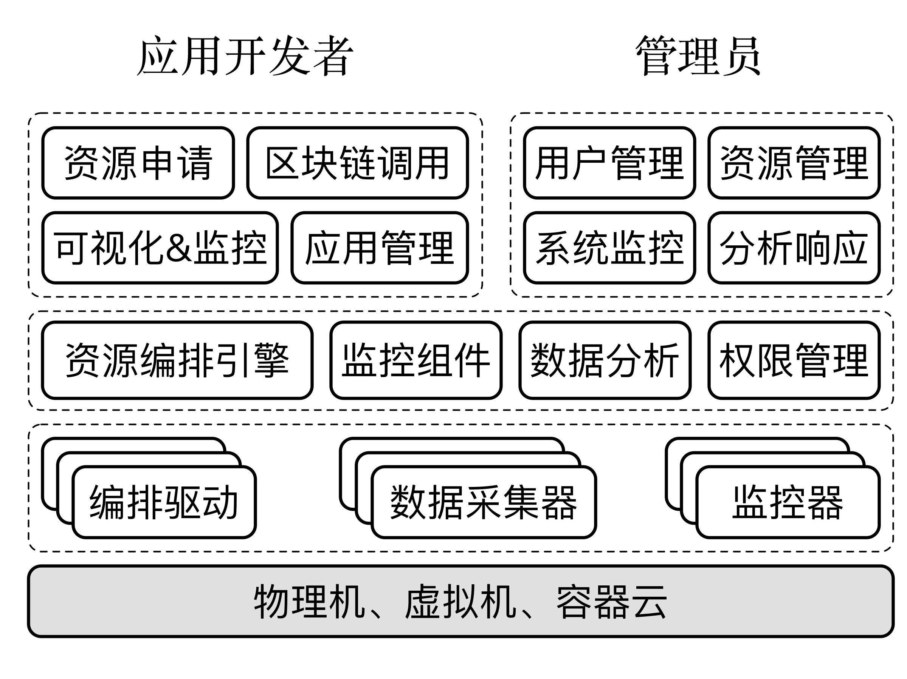

## 简介

区块链即服务（Blockchain as a Service，BaaS），是部署在云计算基础设施之上，对外提供区块链网络的生命周期管理和运行时服务管理等功能的一套工具。

构建一套分布式的区块链方案绝非易事，既需要硬件基础设施的投入，也需要全方位的开发和运营管理（DevOps）。BaaS 作为一套工具，可以帮助开发者快速生成必要的区块链环境，进而验证所开发的上层应用。

除了区块链平台本身，一套完整的解决方案实际上还可以包括设备接入、访问控制、服务监控等管理功能。这些功能，让 BaaS 平台可以为开发者提供更强大的服务支持。

从 2016 年起，业界已有一些前沿技术团队发布了 BaaS 平台，除了商业的方案如 IBM Bluemix 和微软 Azure 云之外，超级账本开源项目也发起了 Cello 项目，以提供一套实现区块链平台运营管理功能的开源框架。

### 参考架构

下图给出了区块链即服务功能的参考架构，自上而下分为多层结构。最上层面向应用开发者和平台管理员提供不同的操作能力；核心层负责完成包括资源编排、系统监控、数据分析和权限管理等重要功能；下层可以通过多种类型的驱动和代理组件来访问和管理多种物理资源。

典型地，BaaS 平台所提供的业务能力通常包括：

* 用户按需申请区块链网络，以及所需的计算、存储与网络连接资源；
* 用户对申请到的区块链进行生命周期管理，甚至支持灵活、弹性的区块链配置；
* 通过提供接口，让用户自由访问所申请到的区块链网络并进行调用；
* 提供直观的区块链可视化监控与操作界面，将区块链应用与底层平台无缝对接；
* 提供简单易用的智能合约开发与测试环境，方便用户对应用代码进行管理；
* 为管理员提供用户管理和资源管理操作；
* 为管理员提供对系统各项健康状态的实时监控；
* 提供对平台内各项资源和应用层的数据分析和响应能力。

### 考量指标

对于 BaaS 服务提供方，搭建这样一套功能完善、性能稳定的 BaaS 平台存在诸多挑战。可以从如下几个角度进行考量设计。

* 性能保障：包括区块链和应用的响应速度，监控实时性等；
* 可扩展性：支持大规模场景下部署和管理的能力，可以快速进行扩展；
* 资源调度：对于非均匀的资源请求类型可以智能的予以平缓化处理，合理分配系统资源；
* 安全性：注意平衡用户操作区块链的自由度与平台自身的安全可控；
* 可感知性：深度感知数据行为，如可以准确实时评估区块链的运行状况，给用户启发；
* 底层资源普适性：底层应当支持多种混合计算架构，容易导入物理资源。

此外，对于面向开发者的 BaaS 服务，创建的区块链环境应当尽量贴近实际应用场景，让用户可以将经过检验的区块链模型很容易地迁移到生产环境。甚至可以直接联动支持第三方发布平台，直接将经过验证的应用推向发布环境。
